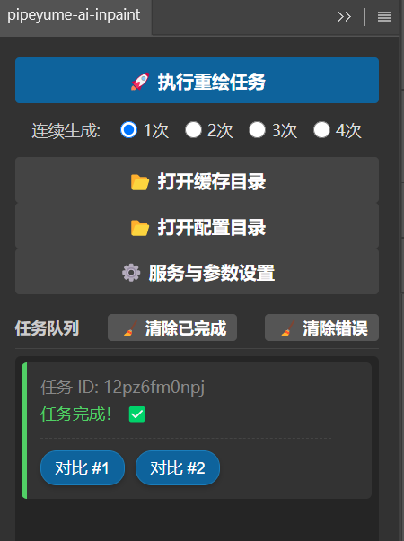
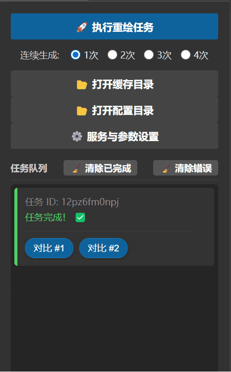
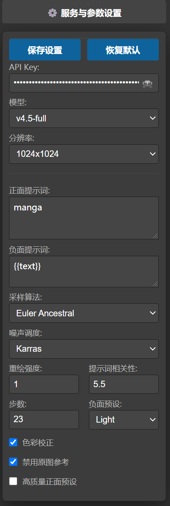

# Photoshop AI重绘 CEP插件

基于套索选区调用 [nai.idlecloud.cc](https://nai.idlecloud.cc/api_docs.html) API 接口使用 NovelAI 模型进行选区重绘的 Photoshop 插件（大量代码使用 gemini3 生成）。

## 🎨 界面预览

<table align="center" style="border: none;">
  <tr>
    <td valign="top" align="center">
      
      <br/><br/>
      
    </td>
    <td valign="top" align="center">
      
    </td>
  </tr>
</table>

## ✨ 功能特性

* **选区重绘**：使用套索工具（或其它选区工具）创建选区，插件自动识别并重绘**当前选中图层**的选区内容。当选中图层大于分辨率时，选区会自动截取图层上满足分辨率的范围作为重绘底图。生成的图像（仅蒙版部分）会放在 `ai_generated` 图层组下。
* **连续生成**：支持单次任务连续生成 1-4 次，内置任务队列与状态管理。
* **实时预览**：在插件面板中预览生成结果，提供直观的滑动条对比功能。
* **参数配置**：支持模型选择、正负面提示词、分辨率、步数、采样算法、噪声调度等高级参数调整。
* **历史记录**：保存最近任务记录，方便回溯，意外关闭插件也能恢复任务UI。
* **缓存/配置文件夹**：插件生成的图片、配置会被储存在两个文件夹，需要**手动清理**。

## 📦 安装方法

1. 将 `com.github.pipeyume.ps_ai_inpaint_plugin` 文件夹复制到 Photoshop 插件安装目录：
   * `PS安装目录\Required\CEP\extensions\[插件文件夹放在这里]`
   * 或者 `C:\Program Files (x86)\Common Files\Adobe\CEP\extensions`
2. 重启 Photoshop。
3. 在菜单栏选择 **窗口 > 扩展功能 > pipeyume-ai-inpaint** 打开插件面板。

## 🚀 使用说明

1. **准备工作**：访问 [nai.idlecloud.cc](https://nai.idlecloud.cc) 注册并获取 API 密钥，在插件面板中输入 API Key 并保存设置。
2. **创建选区**：在 Photoshop 中使用套索工具创建选区。
3. **执行重绘**：打开插件面板，调整重绘参数，点击“🚀 执行重绘任务”按钮。
4. **等待生成**：等待 AI 生成完成，预览结果。

> **💡 隐藏操作**：连续点击“服务与参数设置” 4 次以开关 debug 模式。

## 🛠 技术架构

* **前端界面**：HTML/CSS/JavaScript
* **Photoshop 集成**：CEP（Common Extensibility Platform）
* **通信层**：CSInterface.js + ExtendScript（JSX）
* **API 客户端**：基于 Fetch 的异步请求

## 📂 文件结构

```text
com.github.pipeyume.ps_ai_inpaint_plugin/
├── CSXS/
│   └── manifest.xml          # 插件配置文件
├── css/
│   └── style.css            # 样式文件
├── img/
│   └── icon.png             # 插件图标
├── js/
│   ├── CSInterface.js       # Photoshop CEP 接口
│   ├── main.js              # 主逻辑
│   ├── services.js          # API 服务封装
│   └── imageProcessor.js    # 图像处理工具
├── jsx/
│   └── main.jsx             # ExtendScript 脚本
└── index.html               # 插件主界面
```

## 📄 许可证

MIT License
